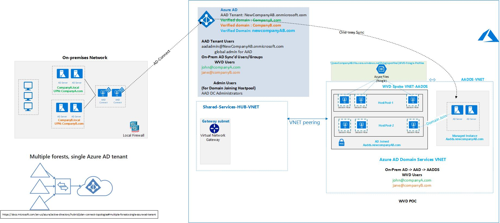
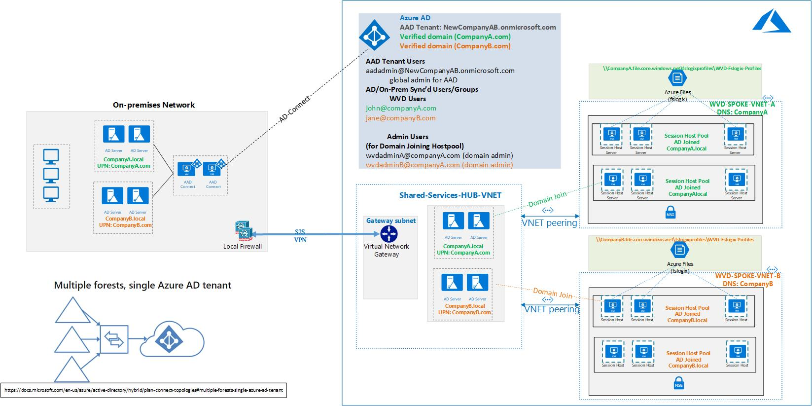
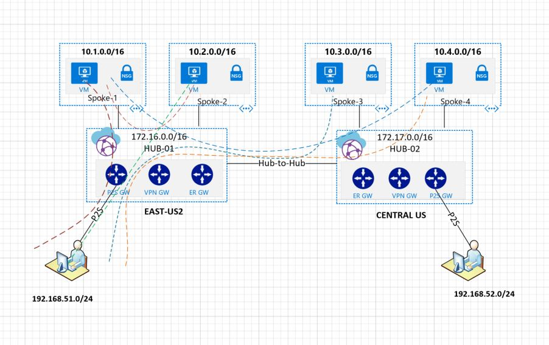

# azure-architectures

Visio Diagrams for Azure Architectures based on Partner ADS sessions

## WVD Architectures

1) Two AD Forests, Single AD Connect, Hybrid Design without VPN

2) Two AD Forests, Single AD Connect, Hybrid Design with VPN

3) Two AD Forests, Single AD Connect, AAD DS (Managed Instance), No VPN

## Virtual WAN Architectures

- Terraform LAB
- With P2S, S2S and ER

