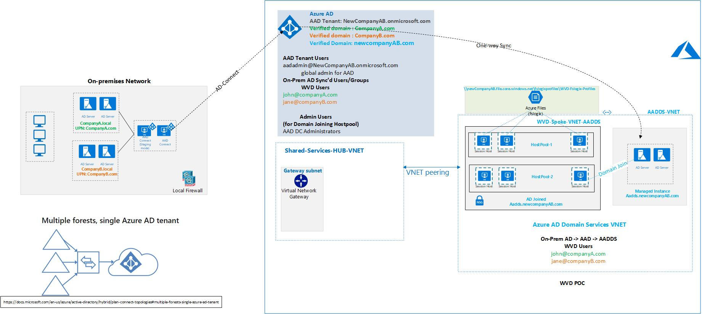

# azure-architectures

Visio Diagrams for Azure Architectures based on Partner ADS sessions

## WVD Architectures

1) Two AD Forests, On-Prem AD Sync to Azure, Hybrid Design with VPN

2) Two AD Forests, On-Prem AD Sync to Azure, AAD DS (Managed Instance) without VPN

3) Two AD Forests, On-Prem AD Sync to Azure, AAD DS (Managed Instance) with VPN

## Virtual WAN Architectures

- Terraform LAB
- With P2S, S2S and ER

